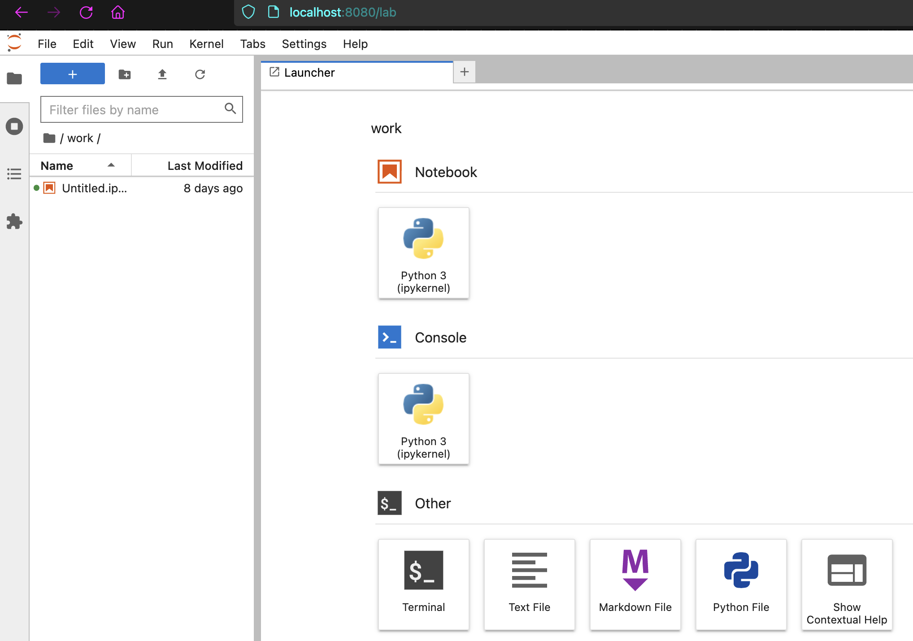

## Configuration

### Postgres

1. Pull and run a lightweight image of Postgres:
```
docker run -d \
    --name my-postgres \
    -p 8081:5432 \
    -e POSTGRES_PASSWORD=mysecretpassword \
    -e POSTGRES_USER=myself \
    -v ./db:/home/data \
    postgres:14-alpine
```
2. Create the role and the db:

```
# Login
docker exec -it my-postgres psql -U myself -W

# Create role
CREATE ROLE postgres LOGIN SUPERUSER PASSWORD 'mysecretpassword';

# Create db
CREATE DATABASE dvdrental;

exit;

# Unzip the file with the command
tar xvf /home/data/dvdrental.tar

# Import the database
docker exec -it my-postgres pg_restore -U myself -d dvdrental /home/data/dvdrental.zip -W

exit
```

### Spark

1. Copy the postgres driver to the spark jars library:

```
# Create your jupyter container
docker run -d \
    --name=my-spark \
    -v ./notebook:/home/jovyan/jupyter \
    -p 8080:8888 \
    --shm-size=5g \
    jupyter/pyspark-notebook
    
# Login in your spark container as a root user

docker exec -u 0 -it my-spark /bin/bash

# Go to the following route:
cd /usr/local/spark/jars

# Copy you postgres driver to the current directory:
cp /home/jovyan/jupyter/postgresql-driver.jar ./

exit

# Enter to your container now as the regular user
docker exec -it my-spark /bin/bash

# Copy your Jupyter token
jupyter server list
```

### Jupyter

1. Go to any web browser and type
> localhost:8080

2. Use the previous token in order to access Jupyter notebooks.

3. In the main menu select a new Python 3 Notebook.



4. First we need to import libraries and create the Spark Session which we'll use for the entire notebook:

``` Python
from pyspark.sql import SparkSession


spark = SparkSession \
    .builder \
    .appName("SparkApp") \ # Choose a name for your application
    .config("spark.jars", "postgresql-driver.jar") \ #Use the postgres driver as a config
    .getOrCreate() 
```

5. We need to create a dataframe using the postgres driver, also specifying the url and the table to which we are going to read, in this case will be the inventory table.

```Python

inv_df = spark.read \
    .format("jdbc") \
    .option("url", "jdbc:postgresql://localhost:8081/dvdrental") \ # Postgres URL
    .option("dbtable", "inventory") \ # DB Table
    .option("user", "myself") \ # User
    .option("password", "mysecretpassword") \ # Password
    .option("driver", "org.postgresql.Driver") \ # PSQL driver
    .load()
```

6. Print the schema of your dataframe obtained from your postgres table:

```Python
inv_df.printSchema()
```

7. Show the first rows of your dataframe in order to get related to the information.

```Python
inv_df.show(5)
```

8. Also we can create different dataframes for a new table, in this case we use the film table.

```Python
film_df = spark.read \
    .format("jdbc") \
    .option("url", "jdbc:postgresql://3.85.128.234:8081/dvdrental") \
    .option("dbtable", "film") \
    .option("user", "myself") \
    .option("password", "mysecretpassword") \
    .option("driver", "org.postgresql.Driver") \
    .load()

film_df.show(5)
```

9. An advantage of Spark it's that we can use different data sources to perform our transformations, in this case we use a [parquet](https://parquet.apache.org/docs/overview/) format.

```Python
# First we need to define the data of the parquet file, in this case we use a list of tuples to do it
parquet_data = [("James ","","Smith","36636","M",3000),
              ("Michael ","Rose","","40288","M",4000),
              ("Robert ","","Williams","42114","M",4000),
              ("Maria ","Anne","Jones","39192","F",4000),
              ("Jen","Mary","Brown","","F",-1)]

# Then we have to specify the colums of our parquet
parquet_columns = ["firstname","middlename","lastname","dob","gender","salary"]

# And finally create a dataframe using our data and columns as parameters
parquet_df = spark.createDataFrame(parquet_data, parquet_columns)
```

10. In the previous step we only created a dataframe inside Spark, we need to create the parquet using our dataframe also.

```Python
# Write the content of your dataframe in a parquet file
parquet_df.write.parquet("people.parquet")
```

11. That was a parquet creation, but What about reading an existing parquet? Also we can do that.

```Python
people_df = spark.read.parquet("people.parquet")
people_df.show()
```

12. We can use filters on our dataframes creating a new dataframe.

```Python
male_people_df = people_df.filter('gender ==="M"')
```

13. Also we can add more rows to our parquet.

```Python
# Append the male parquet to our people parquet
male_people_df.write.mode('append').parquet("people.parquet")
# Read again from our people parquet
m_df = spark.read.parquet("people.parquet")
# Then we can check males are duplicated in our parquet
m_df.show()
```

14. Also we can create Temporal Views to save ephemeral  or irrelevant data.

```Python
# Create or temp table
people_df.createOrReplaceTempView("ParquetTable")
# Executing a SQL query in order to retrieve data from our temp table
sql_context = spark.sql("select * from ParquetTable where salary >= 4000 ")
# Check the content of your query
sql_context.show()
```

15. Alternatively we can create the temporary view directly into the parquet file.

```Python
spark.sql("CREATE TEMPORARY VIEW PERSON USING parquet OPTIONS (path \"people.parquet\")")
spark.sql("SELECT * FROM PERSON").show()
```

16. We can partition our tables in order to improve our query speed.

```Python
# We create a new parquet file called people2 to allocate our new partition
people_df.write.partitionBy("gender","salary").mode("overwrite").parquet("people2.parquet")
```

17. In order to retrieve the partition we need to specify it in read method.

```Python
male2_df = spark.read.parquet("people2.parquet/gender=M")
male2_df.show(truncate=False)
```

18. Also you can a create a temp view from a partitioned parquet file

```Python
spark.sql("CREATE TEMPORARY VIEW PERSON2 USING parquet OPTIONS (path \"people2.parquet/gender=F\")")
spark.sql("SELECT * FROM PERSON2" ).show()
```